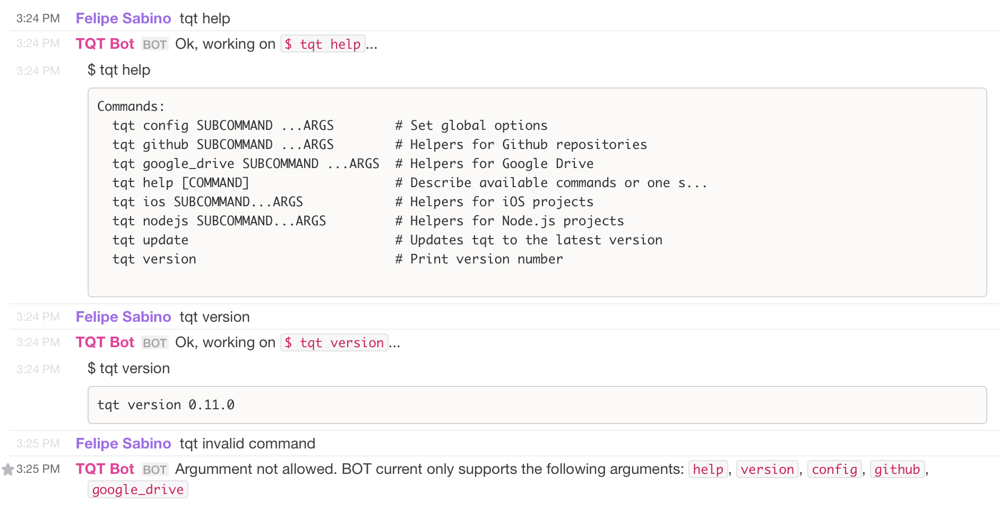

# Awesome Bot

[](https://travis-ci.org/indigotech/tqt-bot)

Bot to access [tqt](https://github.com/indigotech/tqt) remotely on users' behalf.

(Based on [slack's example](https://github.com/slackhq/node-slack-client/blob/master/examples/simple_reverse.coffee) code)

## Configure

This bot runs using [node-foreman](https://github.com/strongloop/node-foreman), so to set up you local environment variables, create .env file with the following values

- `SLACK_TOKEN`: Token to be used to connect to Slack. Check https://my.slack.com/services/new/bot to create/get one.

_tip:_ You can use [`.env.example`](.env.example) file as a template for the config

## Running

- Tested only on node.js `v0.12.0`

- Execute:
```
$ npm install
$ npm start
```

## Testing

```
$ npm test
```

## Usage example



